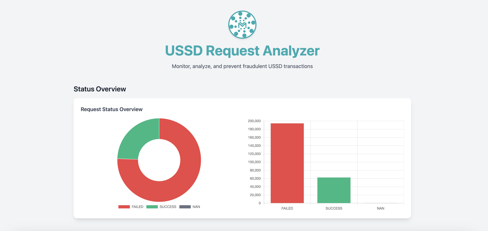
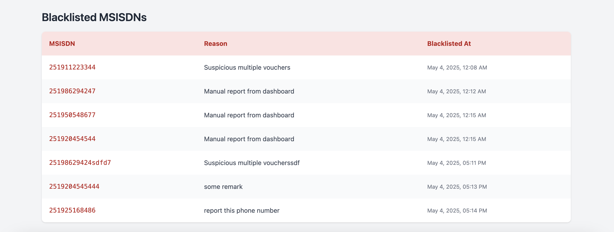
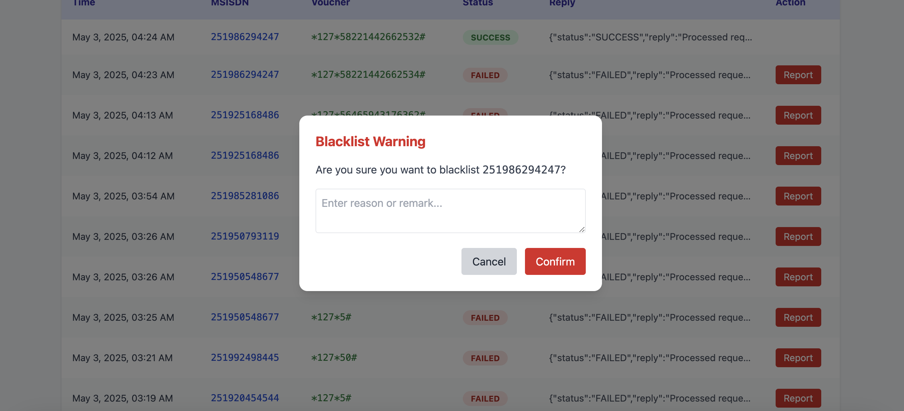
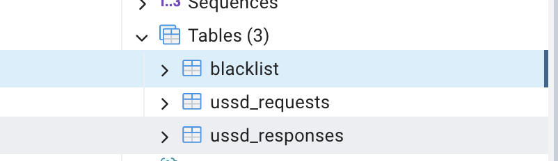
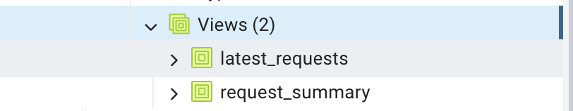

# 📱 USSD Request Analyzer

> A complete mini-platform to analyze USSD request flows, detect fraud, and track system responses — built for **Matrix Technology PLC**.


---

## 🚀 Features

✅ **Success / Failure Report**  
Real-time summary of USSD request outcomes by status (e.g., `SUCCESS`, `FAILED`).

✅ **Latest Requests Table**  
View and filter the most recent USSD requests and their corresponding responses in a paginated table.

✅ **Fraud Detection & Blacklisting**  
- Detect suspicious behavior (e.g. multiple voucher attempts)
- Instantly flag MSISDNs and store reasons
- View all blacklisted numbers in a dedicated section

✅ **Responsive UI**  
- Built with **TailwindCSS**  
- Mobile-friendly and clean layout with color-coded badges and interactive charts

---

## 📸 Screenshots


### 🧭 Demo Video  
[](https://drive.google.com/file/d/1zY8-AKkcdo3pOJWUJIQPUAm3z_cB2HbR/view?usp=sharing)


### 📊 Chart Summary  


### 📝 Latest Requests  


### 📝 Blacklisting   


### 📝 Blacklisting Modal  


### 📝 Used Tables  


### 📝 Used Views  

---

## 🛠 Technologies Used

- **Frontend**: React + TypeScript + TailwindCSS
- **Backend**: Go (Golang) + `net/http`
- **Database**: PostgreSQL

---

## 🧰 Setup Instructions

### 🔧 Backend

```bash
cd backend
go run cmd/main.go
```

> Ensure PostgreSQL is running and accessible with correct credentials.

---

### 🖥 Frontend

```bash
cd frontend
npm install
npm run dev
```

> Access the UI via: [http://localhost:5173](http://localhost:5173)

---

### 🗃 SQL Setup

```bash
# Create schema and views
psql -U postgres -d ussd_analyzer -f schema.sql

# Seed data
psql -U postgres -d ussd_analyzer -f ussd_seed_data.sql
```

---

## 📁 Folder Structure

```
backend/
├── cmd/main.go
├── internal/
│   ├── infra/postgres/
│   ├── infra/rabbitmq/
│   ├── handlers/
│   └── models/

frontend/
├── src/components/         # 6 reusable components
├── src/services/           # API abstraction layer
├── src/types/              # Shared interfaces
├── src/App.tsx
├── index.html
└── tailwind.config.ts
```

---

## 📈 Scalability & Future Improvements

- ✅ **Stateless Backend** → Easily containerized (Docker-ready)
- ✅ **PostgreSQL Optimization** → Indexes on `correlation_id`, `timestamp`
- 🔁 **gRPC/REST Extensions** → Expose endpoints for external services
- 🧠 **Caching (Redis)** → For heavy `summary` queries
- 📥 **Batch Ingestion Pipeline** → For high-volume request logs

---

## 📤 Deliverables

- ✅ `schema.sql`
- ✅ `ussd_seed_data.sql`
- ✅ Complete Go backend
- ✅ React frontend
- ✅ This `README.md`
- ✅ 1-pager scalability write-up

---

## 🧑‍💻 Author

**Built with ❤️ by [Kirubel Gizaw](https://github.com/kirubhel)**  
for **Matrix Technology PLC** – May 2025

---

## 📄 License

This project is private and delivered exclusively to Matrix Technology PLC. Distribution outside this scope requires permission.
